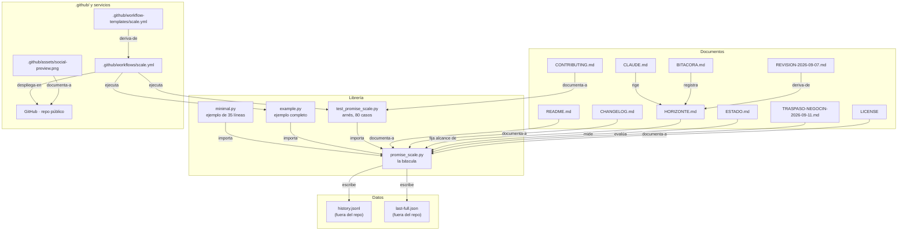

# PROYECTO_MAPA — promise-scale

> **Documento interno del parque, en español.** El repositorio es **público y está
> en inglés**: el `README.md`, el `CONTRIBUTING.md`, el `CHANGELOG.md` y todo el
> código se leen en inglés y **no se traducen**. Este mapa, `CLAUDE.md`,
> `HORIZONTE.md`, `BITACORA.md` y `ESTADO.md` son los documentos internos y van en
> español, como en los otros 20 proyectos del servidor.
>
> **Esta copia manda.** `PROYECTO_MAPA.md` en la raíz del repositorio es el mapa
> canónico; no hay otras copias. Si alguna apareciera, lo declara en su cabecera.
>
> **El mapa describe, no decide.** Cuando el mapa y el disco o la máquina viva
> discrepen, **el que está mal es el mapa**.

---

## 🧭 Resumen para agentes

**Qué es:** `promise-scale`, una librería de Python de **un solo archivo, sin dependencias** (Python 3.9+, MIT) para declarar lo que un sistema promete y pesarlo. Su tesis: **`unmeasurable` nunca cuenta como verde**.
**Stack:** Python 3.9+ puro, sin framework de pruebas, sin `pip install`. Arnés propio de fallas plantadas. CI en GitHub Actions (3.9 / 3.11 / 3.13).
**Componentes:** la librería (`promise_scale.py`), dos ejemplos ejecutables (`minimal.py`, `example.py`), el arnés (`test_promise_scale.py`), y el CI + plantilla en `.github/`.
**Estado (medido 2026-09-12):** `python3 test_promise_scale.py` → 80 `ok`, `missed=0`, EXIT=0; `python3 example.py --test` → `cases=19 missed=0`. Código **COMPLETADO**; el negocio lo cerró el holding el 2026-09-11 (corte 2026-10-02). Local y remoto coinciden: `git rev-parse HEAD` = `git ls-remote origin refs/heads/master` = `bf3fadc`.
**Los tres documentos a leer primero:** `CLAUDE.md` (cómo crece y qué manda) → `HORIZONTE.md` (el alcance comprometido C1–C14 y lo irreversible) → `ESTADO.md` (la foto medida del 2026-09-12).
**Cobertura de este mapa:** **leídos a fondo** — `README.md`, `CHANGELOG.md`, `CONTRIBUTING.md`, `HORIZONTE.md`, `ESTADO.md`, `.gitignore`, `.github/workflows/scale.yml`, `.github/workflow-templates/scale.properties.json`, `minimal.py` (entero) y la estructura declarada de `promise_scale.py`, `example.py` y `test_promise_scale.py` (firmas, decoradores y constantes, no línea por línea). **Nombrados sin abrir a fondo** — `BITACORA.md`, `REVISION-2026-09-07.md`, `TRASPASO-NEGOCIN-2026-09-11.md` (leídos por secciones), `LICENSE`, `.claude/pending-skill-log/revision-2026-09-07.md`. **Excluidos** — `.git/`, `__pycache__/`, `.venv/`, `*.jsonl` (ignorados por `.gitignore`), `.github/assets/social-preview.png` (binario: se nombra, no se abre) y este propio `PROYECTO_MAPA.md`.
**Ranking:** **medido** con `git log --format=format: --name-only | sort | uniq -c | sort -rn` y con grep de referencias entrantes; los archivos especiales (`README.md`, `CLAUDE.md`, CI) entran siempre.

---

## 🗺️ Grafo del proyecto



19 nodos, todos con al menos una arista; 0 huérfanos.

---

## 📁 Nodos por módulo

El proyecto es **single-file por decisión escrita** (`HORIZONTE.md` C10: un archivo,
sin dependencias, sin `pip install`). Por eso los nodos no son carpetas: son las
responsabilidades del archivo y los archivos que lo rodean.

### `promise_scale.py` — la báscula (839 líneas, medido con `wc -l`)

Es el único archivo que se copia a otro proyecto. Todo lo demás es ejemplo, prueba o
documento. Sus responsabilidades, en el orden en que aparecen:

| Responsabilidad | Símbolos | Línea |
|---|---|---|
| Los cinco estados | `CUMPLE` `AVISO` `NO_CUMPLE` `UNMEASURABLE` `UNMEASURED` | 85–89 |
| Declarar una promesa | `promise()`, `check()` | 134, 172 |
| «Desde cuándo» | `History`, `since_when()`, `_age()`, `_hours()` | 178, 223, 246, 256 |
| La báscula se pesa a sí misma | `last_run_at()`, `_late_after()`, `judge_last_run()` | 291, 301, 310 |
| Lecturas caras con su edad | `Carry` | 340 |
| Fallas plantadas | `planted()`, `_coverage()`, `run_planted()` | 425, 459, 478 |
| El parte y el veredicto | `Scale` (con `expect_every=` en 545), `main()` | 521, 833 |

Versión en disco: `__version__ = "0.2.0"` (`promise_scale.py:74`).
Enlaces: [[minimal.py]] · [[example.py]] · [[test_promise_scale.py]] · [[README.md]] · [[CHANGELOG.md]]

### `minimal.py` — la báscula más chica que se puede copiar

35 líneas (24 sin blancos ni comentarios, medido). Dos promesas con números
falsos, para que alguien copie el archivo y sustituya los números. Es lo que el
`README.md` promete en *«Try it in 30 seconds»*.
Medido 2026-09-12: `python3 minimal.py` → `All 2 measured promises are kept.` EXIT=0.
Enlaces: [[promise_scale.py]] · [[README.md]]

### `example.py` — el ejemplo completo, y el que demuestra las tres capacidades de 0.2.0

300 líneas. **6 promesas declaradas** (`P1`–`P6`) más la implícita `scale` = las 7 que
anuncia el README. Enciende `expect_every="24h"` y `carry=`, así que en una máquina
limpia la **primera** corrida sale **EXIT=3** a propósito (todavía no puede saber que
corrió) y la segunda sale 0. Trae **19 casos plantados** (`@planted`), medidos.
Separa la **lectura** (`read_*`) del **juicio** (`judge_*`), que es la regla de
`CONTRIBUTING.md` que hace plantables las promesas.
Escribe fuera del repo, en `~/.local/share/example-scale/`.
Enlaces: [[promise_scale.py]] · [[CONTRIBUTING.md]] · [[.github/workflows/scale.yml]]

### `test_promise_scale.py` — el arnés propio

444 líneas, **80 casos**, sin `pytest` ni ninguna dependencia (medido 2026-09-12:
80 líneas `ok`, `[scale-self-test] missed=0`, EXIT=0). Es el arnés de la propia
librería; el de `example.py` es aparte y se corre con `--test`.
Enlaces: [[promise_scale.py]] · [[.github/workflows/scale.yml]]

### `.github/` — quién lo corre cuando nadie mira

- `.github/workflows/scale.yml` — el CI. Dos arneses en matriz de **3.9 / 3.11 / 3.13**, en `push` y `pull_request`. Corre `example.py --all --brief` **dos veces** y **exige que la primera salga 3**: es la prueba de punta a punta de que la báscula se vigila a sí misma.
- `.github/workflow-templates/scale.yml` + `.github/workflow-templates/scale.properties.json` — la plantilla que GitHub ofrece en la pestaña *Actions* de otros repos.
- `.github/assets/social-preview.png` — la imagen de vista previa. **Está en el repo y NO está asignada** en los ajustes de GitHub (medido 2026-09-12: `og:image` → `opengraph.githubassets.com`, que es la tarjeta que GitHub genera solo).

### `.claude/` — los rastros de las mesas

`.claude/pending-skill-log/revision-2026-09-07.md`: el candidato de log que dejó la
skill `/revision` el 2026-09-07, pendiente de integrar al log canónico del parque.
No es código ni documento del producto.

---

## 📄 Documentos maestros

| Ruta | Qué define | Qué decisiones fija |
|---|---|---|
| `README.md` | **(inglés, público)** Qué es y cómo se usa en 30 segundos | Los cinco estados y sus códigos de salida; «copiar un archivo» es toda la instalación; qué **no** es (ni monitoreo, ni framework, ni orquestador) |
| `CONTRIBUTING.md` | **(inglés, público)** La regla de contribución | Una promesa nueva llega con su caso plantado o no llega; separar lectura de juicio; qué se rechaza (una dependencia, un segundo archivo de librería, suavizar `unmeasurable`) |
| `CHANGELOG.md` | **(inglés, público)** Historial de versiones | Declara en voz alta la brecha entre `__version__ = 0.2.0` y el release `v0.1.0` en vez de esconderla |
| `LICENSE` | **(inglés, público)** MIT © Heroldo Escobedo | — |
| `CLAUDE.md` | **(español, interno)** La ley local: qué es el proyecto, dónde manda `~/CLAUDE.md` y cómo crece el repositorio | El eje del árbol, qué va y qué NO va en cada carpeta, la prueba de tres, el ciclo de una pasada |
| `HORIZONTE.md` | **(español, interno)** El alcance | C1–C14 **COMPROMETIDOS**; P1–P3 construidas, P4–P5 descartadas; PyPI, exportadores, notificaciones y reintentos **fuera de todos los horizontes**; lo IRREVERSIBLE con su comando escrito |
| `ESTADO.md` | **(español, interno)** La foto medida del 2026-09-12 (cierre-duro) | Veredicto **COMPLETADO**; las promesas abiertas y su clasificación |
| `BITACORA.md` | **(español, interno)** El registro fechado de cada pasada | Historia: no se corrige, se le agrega |
| `REVISION-2026-09-07.md` | **(español, interno)** Dictamen de cobertura de alcance del 2026-09-07 | Historia fechada. Vivo porque `HORIZONTE.md:43` y `BITACORA.md:169` lo citan por nombre |
| `TRASPASO-NEGOCIN-2026-09-11.md` | **(español, interno)** Dictamen del 2026-09-11 | Ninguna pieza de promise-scale es cotizable por Negocín. Historia fechada |

---

## 🗄️ Datos y servicios

**Datos.** El proyecto **no tiene base de datos**. Su único estado persistente son dos
archivos que la báscula escribe **fuera del repositorio** (y que `.gitignore` excluye
con `*.jsonl`):

| Archivo | Quién lo escribe | Para qué |
|---|---|---|
| `history.jsonl` (en `example.py`: `~/.local/share/example-scale/history.jsonl`) | `History` en `promise_scale.py:178` | El «desde cuándo» de cada promesa, y la señal de que la báscula corrió |
| `last-full.json` (en `example.py`: `~/.local/share/example-scale/last-full.json`) | `Carry` en `promise_scale.py:340` | Que la corrida rápida acarree la lectura cara **con su edad** |

**Servicios externos.**

| Servicio | Relación | Medido 2026-09-12 |
|---|---|---|
| GitHub — `github.com/heroldoe-create/promise-scale` (público) | Aloja el repositorio, corre el CI y sirve `raw.githubusercontent.com` | `curl` al repo → **200**; `curl` a `raw…/master/minimal.py` → **200** (el *«Try it in 30 seconds»* del README ya no está roto) |
| GitHub Actions | Corre `.github/workflows/scale.yml` en cada push y PR | Definido en el workflow: matriz 3.9 / 3.11 / 3.13 |
| GitHub Releases | Publica las versiones | API `/releases` → **solo `v0.1.0`**; el código dice `0.2.0`. La brecha está declarada en `CHANGELOG.md` |

**Dependientes.** Ningún proyecto del servidor lo importa como librería. Las
referencias que existen (en `lolo-enterprises` y su worktree de ChatGPT) son de
**inventario del holding**, no dependencias técnicas — así lo midió `ESTADO.md`.

---

## 🎯 Decisiones y estado

**Decisiones de arquitectura detectadas** (todas con su fuente en el repo):

1. **Un solo archivo, sin dependencias, sin `pip install`.** `HORIZONTE.md` C10 y `README.md` *«Install»*. `CONTRIBUTING.md` la defiende: una dependencia y un segundo archivo de librería se rechazan.
2. **`unmeasurable` nunca cuenta como verde, y se ordena por encima de los avisos.** `HORIZONTE.md` C2. Es la tesis; suavizarla se rechaza por escrito.
3. **Arnés propio, sin framework de pruebas.** No hay `pytest` ni `setup.py` ni `pyproject.toml` en disco (comprobado). El CI corre `python3` a secas.
4. **La báscula se pesa a sí misma** (`expect_every=`), **marca las lecturas prestadas** (`source=` / `--own`) y **acarrea las caras con su edad** (`carry=`). Son P1, P2 y P3 del `HORIZONTE.md`, construidas el 2026-09-07.
5. **PyPI está matado**, no pendiente: `HORIZONTE.md` *«Lo que se mira y se decide NO hacer»* — contradice C10.
6. **La brecha de versión se declara, no se esconde.** `CHANGELOG.md` abre diciendo que el código va en `0.2.0` y el release en `v0.1.0`.

**Estado, medido el 2026-09-12:**

| Qué | Comando | Resultado |
|---|---|---|
| El arnés de la librería | `python3 test_promise_scale.py` | 80 `ok`, `[scale-self-test] missed=0`, EXIT=0 |
| El arnés del ejemplo | `python3 example.py --test` | `[planted] cases=19 missed=0`, «every promise has a planted case» |
| El ejemplo mínimo | `python3 minimal.py` | `All 2 measured promises are kept.` EXIT=0 |
| Publicación | `git rev-parse HEAD` vs `git ls-remote origin refs/heads/master` | Iguales (`bf3fadc`): **no hay commits sin publicar** |
| Adopción (experimento C14, día 10 de 30) | API de GitHub | 1 estrella, 0 forks, 0 issues abiertos |

**PENDIENTE DE CONFIRMAR:**

- **El release `v0.2.0`** y **la imagen de vista previa social**. El `ESTADO.md` los clasifica en dos lugares distintos: la tabla de promesas abiertas dice **BLOQUEADA (depende de Heroldo)** y el veredicto del CEO al final del mismo archivo los declara **MATADOS** porque el holding cerró el negocio el 2026-09-11. El mapa **no resuelve** la contradicción: la decide quien manda, no quien describe.
- **El experimento C14** vence el **2026-10-02** por calendario. Un cero al día 30 es un resultado, no un pendiente (`HORIZONTE.md` §C14).

---

## ✅ Comprobación de nodos

Toda ruta citada entre acentos graves en este mapa se extrajo y se probó con
`test -e` desde la raíz del proyecto, el **2026-09-12**:

```bash
$ cd /mnt/respaldo/proyectos/promise-scale && python3 - <<'EOF'
import re, os
pat = re.compile(r'`([^`\n]+)`')
seen = []
for line in open('PROYECTO_MAPA.md'):
    for m in pat.findall(line):
        t = m.strip()
        if re.match(r'^[\w./-]+\.(py|md|json|yml|yaml|png|txt|jsonl|toml)$', t) and t not in seen:
            seen.append(t)
for t in seen:
    print(('OK  ' if os.path.exists(t) else 'NO  ') + t)
EOF
```

Salida del 2026-09-12 — **23 rutas citadas, 19 existen, 4 declaradas como
inexistentes a propósito**. Descontando el propio `PROYECTO_MAPA.md` (auto-excluido:
es la salida de este mapa, no un nodo del proyecto):

```
18 nodos vivos citados / 18 existen en disco  → 0 nodos fantasma
```

```
OK  README.md                          OK  promise_scale.py
OK  CONTRIBUTING.md                    OK  minimal.py
OK  CHANGELOG.md                       OK  example.py
OK  CLAUDE.md                          OK  test_promise_scale.py
OK  HORIZONTE.md                       OK  .github/workflows/scale.yml
OK  BITACORA.md                        OK  .github/workflow-templates/scale.yml
OK  ESTADO.md                          OK  .github/workflow-templates/scale.properties.json
OK  REVISION-2026-09-07.md             OK  .github/assets/social-preview.png
OK  TRASPASO-NEGOCIN-2026-09-11.md     OK  .claude/pending-skill-log/revision-2026-09-07.md
(OK PROYECTO_MAPA.md — auto-excluido del conteo)
NO  history.jsonl    NO  last-full.json    NO  setup.py    NO  pyproject.toml
```

Los dos archivos sin extensión que el extractor no alcanza se comprobaron aparte:
`test -e LICENSE` → existe · `test -e .gitignore` → existe.

**Rutas citadas que NO son nodos vivos y por eso no cuentan** (se nombran a
propósito, con su razón):

- `history.jsonl` y `last-full.json` — se escriben **fuera del repositorio**, en `~/.local/share/example-scale/`, y `.gitignore` excluye `*.jsonl`. No existen en el árbol y **no deben** existir.
- `setup.py`, `pyproject.toml` — **no existen a propósito** (C10: un archivo, sin `pip install`).
- `90_superado/` — no existe: el cierre del 2026-09-12 regresó `REVISION-2026-09-07.md` a la raíz y la carpeta quedó vacía y se quitó (`ESTADO.md`).

---

## 🔄 Bitácora de actualización

- **2026-09-12 — v1.0, generación inicial.** El mapa **no existía**: `REVISION-2026-09-07.md:5-6` lo dice expresamente («No hay `CLAUDE.md` ni `HORIZONTE.md` ni `PROYECTO_MAPA.md`»), así que el atraso es **todo el repositorio: 9 commits, desde `4aa7c2d` (2026-09-02) hasta `bf3fadc` (2026-09-12), 10 días**. Generado por la cadena `/grafo` en el cierre-duro del 2026-09-12, junto con el `CLAUDE.md` (que tampoco existía) y su sección «Cómo crece este repositorio».
