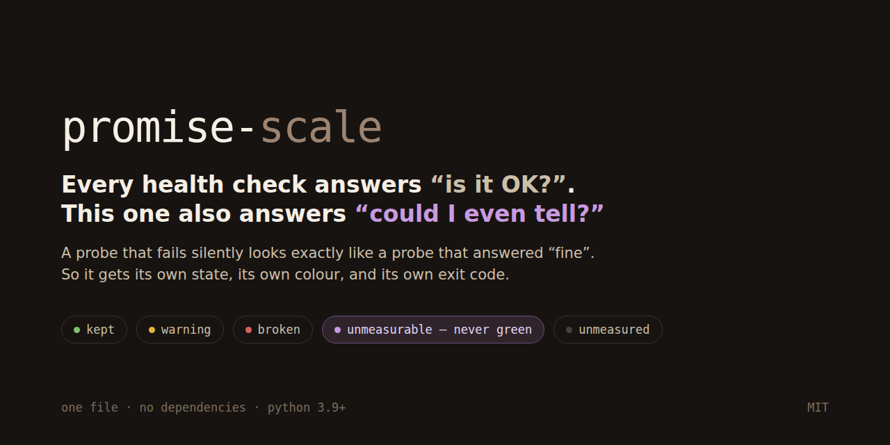

# promise-scale



**How I measure whether my agent system actually keeps what it promises.**

A dashboard that is all green because nobody is looking is worse than a red one.

```python
from promise_scale import promise, Scale, CUMPLE, NO_CUMPLE, UNMEASURABLE

@promise("P1", "Photos from the phone still arrive",
         how="count of files added in the last 24 h, from the backup log")
def _():
    n = photos_added_last_24h()
    if n is None:
        return UNMEASURABLE, "cannot read the photo log", "check the mount"
    if n == 0:
        return NO_CUMPLE, "0 photos in 24 h", "open the app, check it is logged in"
    return CUMPLE, "%d photos arrived" % n, ""

Scale(name="home server").run()
```

```
  home server  v1.4.2  (fast)

  P1    ● KEPT          Photos from the phone still arrive
        41 photos arrived in 24 h
  P2    ● BROKEN        There is a backup, it is recent, and it is not empty
        the backup ran but wrote 0 MB
        like this for 31 h (since 2026-09-01 12:10)
        to fix: check the source path
  P3    ● UNMEASURABLE  The brand mark can actually be seen
        could not compute the contrast
  P4    ● KEPT          There is room on the disk
        314 GB free (67%)

  1 of 4 promises BROKEN: P2
```

Single file. No dependencies. Python 3.9+. MIT.

---

## The one rule that makes this different

**`UNMEASURABLE` never counts as green.**

Every health check answers *"is it OK?"*. This one also answers ***"could I even
tell?"*** — and refuses to round that up.

That is not a philosophical point. It came from a running home server:

> Four containers healthy. The page returning `200`. Clean logs. And the phone
> backup had not uploaded **a single photo in twenty hours**.
>
> Everything being watched was fine. Nobody was watching whether photos arrived.
> The owner noticed on his phone, not on the dashboard.

And its sibling, from the same system, two months later:

> A logo sat on a dark toolbar painting dark ink. Invisible. The automated check
> was green because it asked *"did the image load?"* — **and an image loads fine
> when it paints dark-on-dark.**
>
> Ask for contrast, not for existence.

Both failures are the same shape: **a probe that cannot answer looks exactly like
a probe that answered "fine"**. So this scale gives that its own state, its own
colour, and its own exit code — and orders it *above* warnings, because nobody
investigates a shrug.

---

## The five states

| State | Meaning | Exit code |
|---|---|---:|
| `kept` | measured, and the promise holds | 0 |
| `warning` | measured, holding, but heading the wrong way | 2 |
| `broken` | measured, and it does not hold | 1 |
| **`unmeasurable`** | **we tried to measure and could not** — never green | **3** |
| `unmeasured` | we chose not to run it here (too slow, too costly) | 0 |

The last two look alike and are opposites. `unmeasured` is a decision you made;
`unmeasurable` is a decision the system took away from you.

---

## What you get

**Promises in the words of whoever depends on the system.** `"photos still
arrive"`, not `check_rsync_exit_code`. If you cannot phrase it that way, you are
probably measuring the process instead of the result.

**"Since when."** Each run appends one line to a history file, so a promise says
*"broken for 31 h"* instead of just *"broken"*. Any rule you write about age
—"escalate after 48 hours"— needs this, or it is a rule nobody can apply.

**Planted failures.** `--test` breaks each promise on purpose and demands the
scale *sees* it:

```
  ok   photos: 0 in 24 h -> broken                     expected broken   got broken
  ok   photos: log unreadable -> unmeasurable, NOT fine expected unmeasurable got unmeasurable
  ok   logo: 1.04:1, dark on dark -> broken            expected broken   got broken
  ok   verdict: one unmeasurable -> exit 3, never 0    expected 3        got 3

  [planted] cases=11 missed=0
```

**A scale nobody has seen fail is not a scale — it is a green light with no
wiring behind it.** So: *a new promise arrives with its planted case, or it does
not arrive.*

**A generated promise table.** `--promises` prints your declarations as markdown,
so the documentation and the code cannot drift apart.

**The scale watches whether the scale ran.** A check that never ran and a check
with nothing to report look identical from the outside — this project's own
thesis, one floor up. Tell it how often it is meant to run and it weighs one
more promise, always, before any of yours:

```python
Scale(name="home server", history=".../history.jsonl", expect_every="24h").run()
```

```
  scale ● UNMEASURABLE  This scale has actually been running
        nothing on record says this scale has ever run (it is set to run every 24 h)
        to fix: check whatever is supposed to run this (cron, timer, CI) and the history file
```

Late is `unmeasurable`, never `broken`, and that is the whole point: you have
not learned that the system is bad, you have learned that you stopped looking.
The timestamps were already in the history file — nothing read them for this
until now. The state of the art asks for it by name: *"track check execution
rates to verify monitors run on schedule"* (upstat.io, *Monitoring the
Monitors*, 2025-10-16) and *"heartbeat signals or execution receipts […] so a
missing heartbeat triggers an alert rather than silent absence"* (SD Times,
*Your Agents Aren't Failing. They're Not Running.*, 2026-08-03). It obeys the
project's own rule too: `--test` names `scale` among the promises nobody has
ever seen fail until you plant it.

**Where a reading came from.** Mark the readings you did not take yourself:

```python
@promise("P6", "Nothing is being spent without somebody noticing",
         how="the `spend` sensor inside the sentinel's own report",
         source="the sentinel's report")
```

The source travels with the reading — into the printed report, into `--json`,
into the generated promise table — and `--own` drops every borrowed reading:

```
scale --own      # only what this scale measures itself
```

That is what stops a layer certifying its own earlier word. The sentinel that
*writes* that report runs the scale with `--own`, so it cannot read its own
output back and present it as a fresh measurement.

**Expensive readings, carried with their age.** A three-minute promise cannot
run every fifteen minutes, and calling it `unmeasured` every day leaves the
daily report incomplete by design. So the full run leaves its readings behind
and the fast run carries them forward:

```python
Scale(..., carry="~/.local/share/scale/last-full.json", carry_max_age="26h")
```

```
  P5    ● KEPT          The test suite still catches what it promises to catch
        34/34 — carried from the slow run 4 h ago
```

The age is welded onto the text, not offered beside it: there is no way to
print a carried reading without saying when it was taken, because a stored
reading shown without its age is a stale reading wearing the face of a fresh
one. Past `carry_max_age` it becomes `unmeasurable` — not `unmeasured`: once
you have asked for carried readings, not having one is not a choice you made
in this run. And a carried reading is never written back to the store, or its
clock would restart every fifteen minutes and it would never expire.

---

## Install

Copy `promise_scale.py` next to your code. That is the whole install — it is one
file with no dependencies, on purpose, because a health check that can break
during a `pip install` is a health check with a new way to fail.

```bash
git clone https://github.com/heroldoe-create/promise-scale
python3 example.py           # a full worked example, runs anywhere
python3 example.py           # again: now it can see that it ran once
python3 example.py --all     # and now the slow promise has a reading to carry
python3 example.py --test    # its planted failures
```

**The example's first run is not green, and that is the demonstration.** It
exits 3 because it cannot yet tell that it has ever run — nothing is on record
until it finishes once — and because no full run has left a reading for the
slow promise to carry. Both lines say exactly which command fixes them. A scale
that started life green would be lying about the one thing it is for.

## Use

```bash
scale                 # the fast promises
scale --all           # every mode, including the slow ones
scale --own           # only what this scale measures itself, no borrowed readings
scale --brief         # one line, for cron
scale --json          # for a dashboard or another program
scale --test          # planted failures; exit 1 if the scale missed one
scale --promises      # the promise table, as markdown
```

In `cron`, the exit code carries the verdict:

```
10 4 * * *  /usr/bin/python3 /srv/scale.py --all --json > /var/lib/scale/last.json
```

---

## Writing a good promise

**Split the reading from the judgement.** The reading goes out and gets a number;
the judgement decides what the number means. Keep them apart:

```python
def judge_backup(hours_old, size_mb):        # pure: numbers in, verdict out
    if hours_old is None:
        return UNMEASURABLE, "no backup log at all", "run it by hand once"
    if hours_old > 26:
        return NO_CUMPLE, "last backup %.0f h ago" % hours_old, "run: backup-now"
    if size_mb == 0:
        # An empty backup is worse than a missing one: it looks like success.
        return NO_CUMPLE, "ran but wrote 0 MB", "check the source path"
    return CUMPLE, "%.0f h ago, %d MB" % (hours_old, size_mb), ""

@promise("P2", "There is a backup, it is recent, and it is not empty",
         how="age and size of the newest backup file")
def _():
    return judge_backup(*read_backup())      # reading stays outside
```

That split is what makes planted failures possible: you feed the judgement a
number you invented and demand the right verdict. **A judge that reads the disk
itself cannot be planted, only mocked** — and a scale you cannot plant is a scale
nobody has ever seen fail.

Three more that were learned the expensive way:

- **Measure the result, not the process.** "The backup service is running" is not
  "there is a backup". The first one was green for twenty hours.
- **Never let a probe crash into silence.** A crashing probe here becomes
  `unmeasurable`, not `broken` and not fine: you learned nothing about the promise.
- **Don't let one layer certify another layer's reading.** If your scale reads a
  cached report that your scale wrote, it will happily certify a fresh green on
  stale evidence. Say so with `source=` and run `--own` on the layer that wrote
  the report — that is the mechanism, so this stops being advice you have to
  remember and becomes something the tool can tell you about.
- **Don't parse another program's text.** When a promise is measured by reading
  what some other program printed, a regular expression over its output is
  fragile in the silent way: the other side renames a line, and the promise
  starts answering *wrongly* without ever breaking. Ask that program for json
  with a schema number and named fields, and when a field you declared is
  missing return `unmeasurable` — a missing field is news, not a blank to fill
  in with a default.

---

## What this is not

Not a monitoring system, not an agent framework, not an orchestrator — those
exist and are good. This is the small piece that sits on top of whatever you
already have and asks the question they do not: **can you still tell?**

## Where it comes from

Extracted from a working system that runs several AI assistants —Claude, Codex,
Gemini, DeepSeek, Kimi, GLM— on one home server under one shared set of rules,
one shared work log, and a set of locks that force each of them to leave a
handover note. Its scale weighs fourteen promises, on a cron, and has caught
things that had been quietly broken for hours: a rule file edited and never
regenerated, a repair routine that would have killed the very session it was
repairing, and the invisible logo above.

The orchestration part of that system is not novel — good open-source projects
already do it. **This part I could not find anywhere**, so here it is.

---

## Who else has this state, and what they do with it

The claim above is not that nobody thought of `unmeasurable`. Everybody did.
The claim is about what happens to it next, and that part is checkable:

- **Azure Monitor health models** ship the state under the name **Unknown** —
  *"the health state of the entity can't be determined due to insufficient data
  or a lack of signals."* In the same table, **Unhealthy** carries the note
  *"Counts as downtime for health objective."* **Unknown carries no such note.**
  ([Microsoft Learn, updated 2026-07-21](https://learn.microsoft.com/en-us/azure/azure-monitor/health-models/concepts))
- **Azure Resource Health** is explicit that Unknown *"isn't a definitive
  indication of the state of the resource"*
  ([Microsoft Learn, 2025-11-10](https://learn.microsoft.com/en-us/azure/service-health/resource-health-overview)),
  and at least one monitoring vendor makes alerting on it **opt-out**: a
  *"Alert when the Resource health is unknown → No"* switch
  ([Site24x7 KB](https://support.site24x7.com/portal/en/kb/articles/azure-resource-health-unknown)).

So the state is common and the *ranking* is not. The industry default is that
not-knowing does not count against you. This scale inverts that: `unmeasurable`
gets its own exit code and sorts **above** warnings, because the cost of a
silent probe is not that it is small — it is that nobody investigates a shrug.

The other half — planting failures — has an industry name too, and a number
worth knowing: the practice is called a **chaos drill on your alerts**, and
*"about a third of alerts fail their first drill"*
([dotcom-monitor, 2026-07-15](https://www.dotcom-monitor.com/blog/website-monitoring-best-practices/)).
One in three. That is the measured version of *a scale nobody has seen fail is
not a scale*. Prometheus users have `promtool`'s YAML unit tests for alert
rules; `@planted` is the same idea one layer in — you plant at the judgement
function, in the language the probe is written in, and `--test` tells you which
promises have no planted case at all.

*(Sources found 2026-09-07 with the Perplexity search MCP.)*

---

## The rest of the surface

Everything above is the interesting part. This is the rest, so it is written
down somewhere other than the source:

| | |
|---|---|
| `check(state, detail, remedy)` | a helper so a probe can `return check(CUMPLE, "41 photos")` instead of building the tuple by hand |
| `KEPT`, `WARN`, `BROKEN` | aliases for `CUMPLE`, `AVISO`, `NO_CUMPLE`. The Spanish names are the canonical stored values — renaming them would silently break stored history — and these read better in English code |
| `--no-history` | run without recording anything: no line in the history file, no carried readings stored. Useful in CI, and in any run you do not want counted in "since when" |
| `Scale(expect_every=...)` | how often this scale is supposed to run: `"24h"`, `"15m"`, `"7d"`, or a `timedelta`. A run counts as missing at the cadence plus a tenth of it, so ordinary cron jitter does not make the scale cry wolf about itself. Unset, there is no extra promise and nothing changes; set to something unreadable, the promise says exactly that instead of crashing the run |
| `Scale(self_key=...)` | the key that implicit promise is stored under (default `"scale"`). If one of your own promises already uses it, the scale says so rather than quietly merging the two histories |
| `Scale(carry=..., carry_max_age=...)` | where the expensive run leaves its readings, and how old one may get before it stops counting as a reading at all (default `"26h"` — a daily job plus slack) |
| `@promise(source=...)` | name the other layer a reading comes from. It shows in the report, in `--json` and in `--promises`; `--own` drops those readings entirely |
| `judge_last_run(hours_since, every_hours)` | the self-watch's judgement, exported so you can plant it: numbers in, verdict out, like any other judgement here |
| `python3 -m promise_scale` | prints the module's own documentation. The file is the manual |
| `Scale(history=None)` | disables "since when" entirely. A history that cannot be written never fails a run either — it is a comfort, not a dependency |
| `NO_COLOR=1` | no escape codes. They are also off automatically whenever output is not a terminal |

**On `scale` in the commands above:** there is no binary called `scale` — it
stands for *your* file, whatever you named it. There is no `pip install` and no
entry point on purpose (see Install). Read `scale --all` as
`python3 /srv/my-scale.py --all`.

**On the exit codes:** they belong to the *run*, not to a state. One broken
promise makes the whole run exit 1 even if four others are kept. The order is
`broken (1)` → `unmeasurable (3)` → `warning (2)` → `all kept (0)`; the numbers
are historical, the precedence is the point.

**On the scale watching itself:** it only does when you say how often it should
run. `Scale(expect_every="24h")` is opt-in on purpose — a scale run by hand has
no cadence to be late against, and a promise that is red for a reason nobody
can act on is a promise people learn to ignore. Set it wherever a cron, a timer
or a CI job is what actually runs this. See `HORIZONTE.md` for what is still
open.

## Licence

MIT © Heroldo Escobedo
